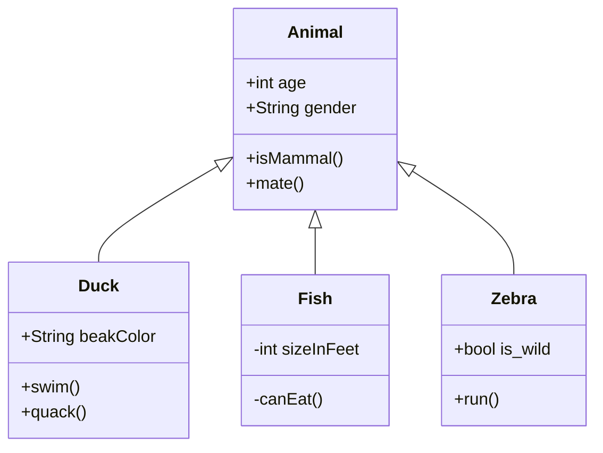
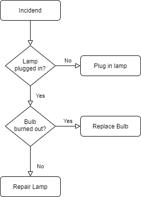

      

<table>
  <tbody>
    <tr>
      <td><a href="https://github.com/Dantalor/markdown-portfolio/edit-diagram.html?repo=markdown-portfolio&amp;path=test.png" target="_blank">Edit</a></td>
      <td><a href="https://app.diagrams.net/#Uhttps%3A%2F%2Fraw.githubusercontent.com%2FDantalor%2Fmarkdown-portfolio%2Fmain%2Ftest.png" target="_blank">Edit As New</a></td>
      <td><a href="https://app.diagrams.net/#HDantalor%2Fmarkdown-portfolio%2Fmain%2Ftest.png" target="_blank">Edit in diagrams.net</a></td>
    </tr>
  </tbody>
</table>

