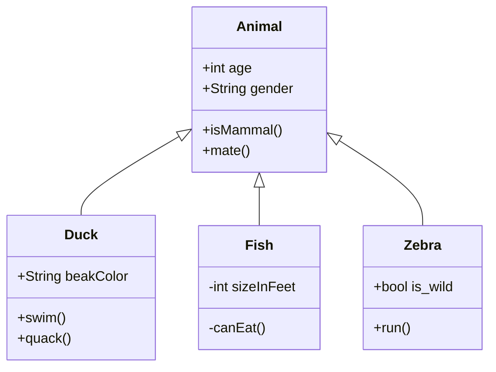

      

<table>
  <tbody>
    <tr>
      <td><a href="http://jgraph.github.io/drawio-github/edit-diagram.html?repo=drawio-github&amp;path=diagram.png" target="_blank">Edit</a></td>
      <td><a href="https://app.diagrams.net/#Uhttps%3A%2F%2Fraw.githubusercontent.com%2Fjgraph%2Fdrawio-github%2Fmaster%2Fdiagram.png" target="_blank">Edit As New</a></td>
      <td><a href="https://app.diagrams.net/#Hjgraph%2Fdrawio-github%2Fmaster%2Fdiagram.png" target="_blank">Edit in diagrams.net</a></td>
    </tr>
  </tbody>
</table>

